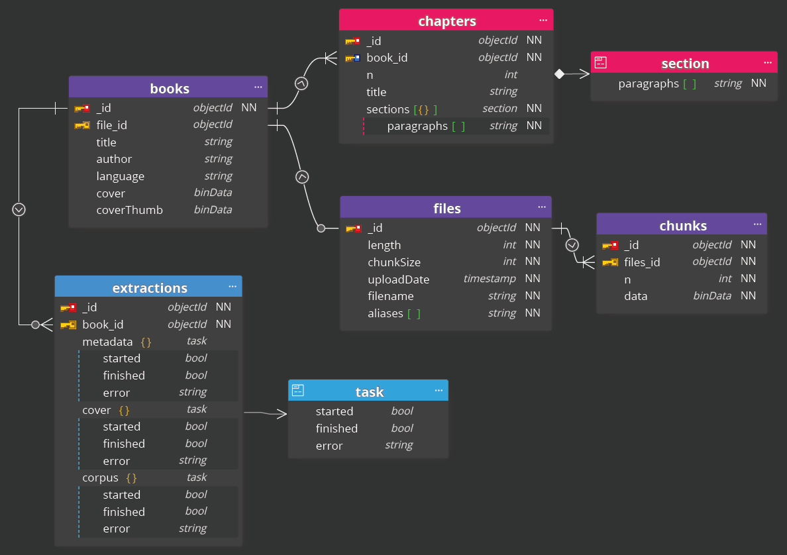

# Writio MVP Datamodel Design

## Datamodel Design Decisions

- Currently a NoSQL schema is targetted.
- The design is intended for MongoDB usage.
- Since MongoDB is assumed, GridFS is currently targetted for ebook file storage. This can change later.

## Datamodel Data Design

### High Level

- Database stores books and their metadata
- Each book is based on an input ebook file
- Each book file is used to extract a corpus, which is seperately stored as unpaginated text

### Low Level

- A book is the main object, it is generated by parsing an ebook file:
  - The following metadata is stored: title, author, language.
  - The book cover is stored as image and a thumbnail.
- The book file is seperately stored:
  - Since the file can be arbitrarily large, the file is stored in chunks.
  - The file is referenced in the book document.
- The text of the book (corpus) is seperately stored from the book:
  - The corpus references the book as parent.
  - It stores the book content as unpaginated text by enumerated chapters.
  - Each chapters contains a title and a number  of sections.
  - Each section is composed by a number of paragraphs, which are arrays of strings.

## Datamodel Data Runtime

- A book is created by injecting a file, hence the file is persisted first.
- The corpus and the book's metadata are retrieved by parsing the book file. This is done in the background. Hence, the correlated data might be added / set at a later point in time in no determined order.
- The thumbnail is derived from the cover image.

## Diagram

