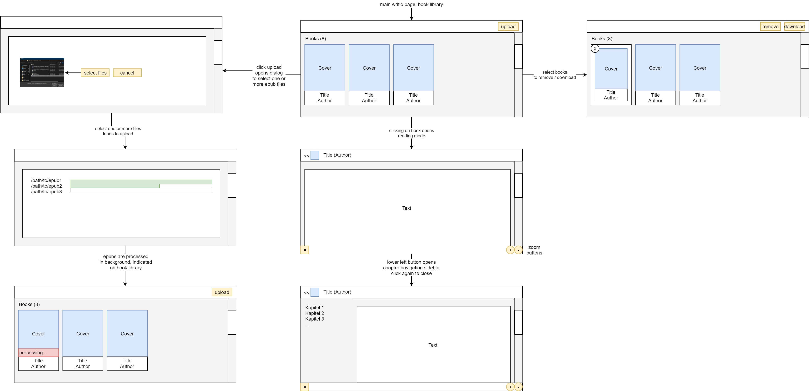

# Writio MVP UX Design

## UX Design

### High Level

- The user can add, delete and download books
- The user can read a book

### Low Level

- Main entrypoint is the book library on which the user can manage books.
  - The user can see how many books are available and which, displayed with cover, name and author.
  - The user can upload new books from epub files from his/her local PC.
  - The user can delete or download selected books.
- The user can upload new books.
  - The user can select one or many books as epub files from the local PC.
  - The files are uploaded and the upload state is shown.
  - Once finished uploading all books, the dialog closes and the user returns to the library.
- Writio processes the uploaded files in the background.
  - The cover image is extracted.
  - The title and author name is extracted.
  - The corpus is extracted and processed so that  it is pageless.
  - Books being processed are indicated on the library page.
- The user can read the book, if he clicks it on the library page.
  - On the reading page, the user can navigate the book with a chapter sidebar, by scrolling vertically.
  - The user can adapt the font size through zoom buttons.

## Page Requirements to the API

### Main Library Page

- get book count
- get books, for each:
  - cover image (medium thumbnail)
  - title
  - author
  - processing state: yes or no
- delete book(s)
- download book(s)

### Upload Dialog

- upload file
- get upload status (%, finished)

### Reader Page

- get for selected book:
  - cover thumbnail (small thumbnail)
  - title
  - author
  - number of pages
  - chapter catalog with page mapping for jumping
  - text corpus

## Wireframes

